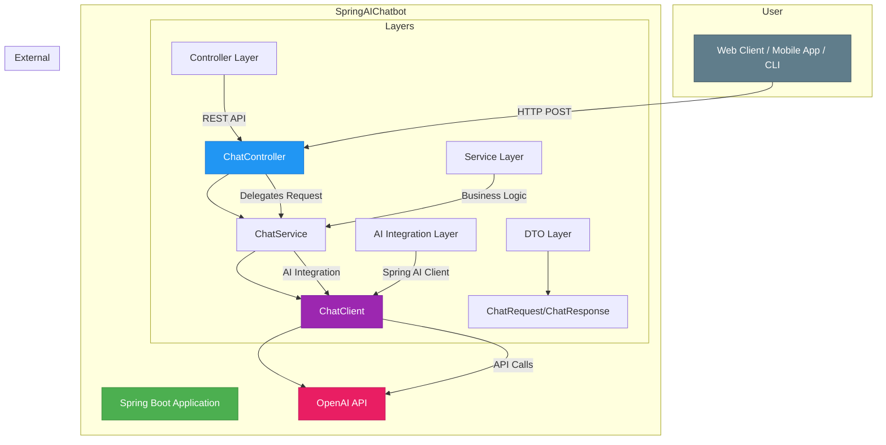

# Spring AI Chatbot Architecture

This document describes the architectural design of the Spring AI Chatbot application.

## System Overview

The Spring AI Chatbot is a RESTful web service that provides an interface to OpenAI's language models through Spring AI. It follows a clean, layered architecture with clear separation of concerns.

## Architecture Diagram

## Component Details

### 1. User Interface Layer
- **Web Client / Mobile App / CLI**: Any client that consumes the REST API
- Communicates via HTTP POST requests to the `/api/chat` endpoint

### 2. Controller Layer
- **ChatController**: Handles incoming HTTP requests
  - Maps to `/api/chat` endpoint
  - Uses `@RestController` annotation
  - Enables CORS with `@CrossOrigin("*")`
  - Accepts `ChatRequest` DTO and returns plain text response
  - Also provides `/api/chat/chatWithStructure` endpoint returning structured `ChatResponse` DTO
  - Delegates AI/business logic to `ChatService`

### 3. Service Layer
- **ChatService**: Encapsulates AI interaction logic
  - Configures and uses Spring AI `ChatClient`
  - Applies memory advisor configuration for conversations
  - Builds prompts and returns plain or structured responses

### 4. Data Transfer Object (DTO) Layer
- **ChatRequest**: Simple POJO for request data transfer
  - Contains `message` field for user input
  - Used for JSON serialization/deserialization
- **ChatResponse**: Structured response DTO
  - Contains `response` field for AI-generated content
  - Used for structured API responses

### 5. AI Integration Layer
- **ChatClient**: Spring AI's high-level client for LLM interactions
  - Configured via Spring Boot auto-configuration
  - Handles communication with OpenAI API
  - Provides fluent API for prompt building and execution
  - Supports system prompts, user messages, and conversation memory advisors

### 6. External Dependency
- **OpenAI API**: External service providing language model capabilities
  - Accessed via Spring AI's OpenAI integration
  - Configured with API key and model parameters
  - Returns AI-generated responses

## Data Flow

1. **User Request**: Client sends HTTP POST request with JSON payload containing message
2. **Controller Processing**: `ChatController` receives request and extracts message from `ChatRequest` DTO
3. **Service Processing**: `ChatService` applies chat memory and builds the prompt
4. **AI Integration**: `ChatClient` calls OpenAI API
5. **Response Generation**: OpenAI API processes request and returns AI-generated response
6. **Response Return**: Response flows back through service → controller → client

## Configuration

The application is configured in `application.properties`:

- `spring.ai.openai.api-key`: Authentication key for OpenAI API
- `spring.ai.openai.chat.options.model`: Specifies GPT model (gpt-4-turbo)
- `spring.ai.openai.chat.options.temperature`: Controls response creativity (0.7)

## Technology Stack

- **Framework**: Spring Boot 3.5.14
- **AI Integration**: Spring AI with OpenAI starter
- **Build Tool**: Maven
- **Language**: Java 25
- **Code Generation**: Lombok for boilerplate reduction

## Security Considerations

- API key is configured via environment variable for security
- CORS is enabled for development but should be restricted in production
- Input validation should be added for production use

## Scalability Considerations

- Stateless architecture allows horizontal scaling
- Can be containerized with Docker for easy deployment
- Supports configuration-based model switching for different AI providers
